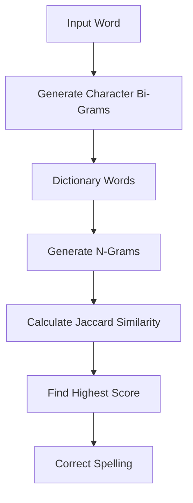
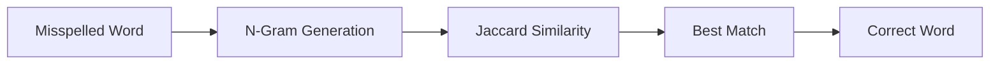

# 🔤 Spelling Correction Using Jaccard Similarity

### 🚀 NLP Project | Python | Character N-Grams | Jaccard Similarity

<p align="center">

</p>

<p align="center">


</p>

---

</div>

# 📖 About Project

This project implements a **Spell Correction System** using the **Jaccard Similarity Algorithm**.

Instead of Machine Learning, this project uses **Character Bi-Grams (2-Grams)** to compare misspelled words with a predefined dictionary and predicts the most similar correct word.

> 💡 Perfect for beginners learning **Natural Language Processing (NLP)** and **Text Similarity Algorithms**.

---

# ✨ Features

✅ Character N-Gram Generation

✅ Jaccard Similarity Calculation

✅ Automatic Spell Correction

✅ Dictionary Based Word Matching

✅ Fast & Lightweight

✅ Beginner Friendly

✅ Google Colab Compatible

---

# 🛠 Tech Stack

| Technology | Usage |
|------------|-------|
| 🐍 Python | Programming Language |
| 📒 Jupyter Notebook | Development |
| ☁ Google Colab | Execution |
| 🔤 Character N-Grams | Feature Extraction |
| 📊 Jaccard Similarity | Similarity Measurement |

---

# ⚙ Working Flow



---

# 🧠 Algorithm

```text
Input Word

↓

Generate Character Bi-Grams

↓

Generate Dictionary Bi-Grams

↓

Calculate Jaccard Similarity

↓

Highest Similarity Score

↓

Correct Word
```

---

# 📂 Project Structure

```bash
📦 Spelling-Correction-Using-Jaccard-Similarity
│
├── 📒 Spelling Correction Using Jaccard Similarity.ipynb
├── 📄 README.md
└── 📜 LICENSE
```

---

# 📊 Example

### Input

```python
word = "recive"
```

⬇

### Output

```text
Input Word        : recive

Correct Word      : receive

Similarity Score  : 0.75
```

---

# 📚 Concepts Covered

| NLP Concepts | Python Concepts |
|--------------|----------------|
| Character N-Grams | Functions |
| String Matching | Loops |
| Text Similarity | Lists |
| Jaccard Index | Sets |
| Spell Correction | Dictionary |

---

# 🎯 Applications

🔍 Search Engines

✍ Auto Correct

💬 Chatbots

📱 Messaging Apps

📖 Text Editors

🤖 NLP Preprocessing

📑 OCR Correction

---

# 🚀 Future Scope

- ✅ Large English Dictionary
- ✅ Levenshtein Distance
- ✅ Trigram Support
- ✅ Multiple Suggestions
- ✅ Streamlit Web App
- ✅ Voice Based Spell Checker
- ✅ Machine Learning Integration

---

# 📈 Workflow



---

# ▶ Installation

```bash
git clone https://github.com/yourusername/Spelling-Correction-Using-Jaccard-Similarity.git
```

```bash
cd Spelling-Correction-Using-Jaccard-Similarity
```

```bash
jupyter notebook
```

or

Open directly in **Google Colab**

---

# 🤝 Contributing

Contributions are always welcome!

```text
Fork 🍴

↓

Create Branch 🌿

↓

Commit Changes 💻

↓

Push 🚀

↓

Pull Request ❤️
```

---

# 📊 Project Statistics

| Feature | Status |
|---------|--------|
| Python | ✅ |
| NLP | ✅ |
| Spell Correction | ✅ |
| Character N-Grams | ✅ |
| Jaccard Similarity | ✅ |


<div align="center">

## 👨‍💻 Author
👨‍💻 Mukul Kumar
Data Analytics Enthusiast

📞 Phone: 9315005376 | 📧 Email: mukulpal2004@gmail.com

⭐ If this project helped you, consider giving it a star! ⭐


### Thanks for Visiting ❤️


